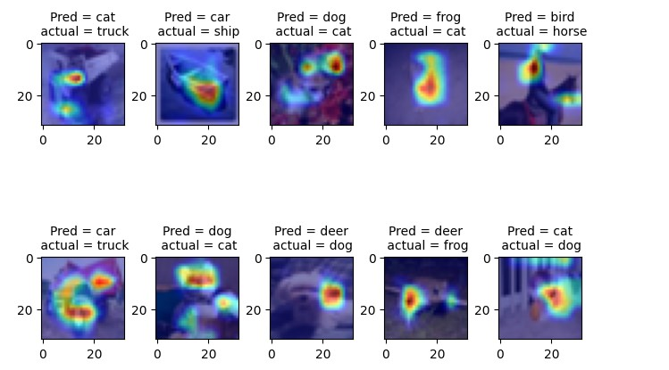

# Session 11 — ResNet18, Misclassifications, and Grad-CAM

This session trains ResNet18 on CIFAR-10 and moves model, data, training, and visualization logic into reusable Python modules.

## Core concepts

- **Residual networks:** identity shortcuts make an 18-layer CNN easier to optimize.
- **CIFAR-10 augmentation:** random crop and CutOut regularize the network.
- **Learning-rate range testing and One Cycle scheduling:** the training rate is selected empirically and varied across the run.
- **Error analysis:** misclassified test examples reveal recurring failure modes beyond aggregate accuracy.
- **Grad-CAM:** class gradients weight convolutional feature maps to highlight image regions that influenced a prediction.
- **Separation of concerns:** notebooks orchestrate experiments while model and utility modules own the implementation.

## Contents

- `models/resnet.py` contains the ResNet18/34 implementation; `models/custom_resnet.py` contains the earlier custom network.
- `utils.py` provides transforms, train/test loops, metric plots, misclassification collection, and Grad-CAM helpers.
- `S11.ipynb` trains for 20 epochs and visualizes errors and explanations.
- `Results_GradCAM.jpg` summarizes representative Grad-CAM output.

## Result

